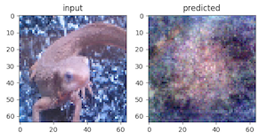
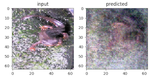
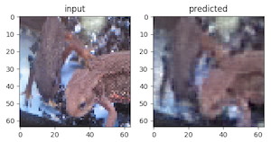
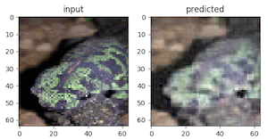

# Q. 画像生成編

ここでは画像生成の手法を自分の手で実装していきます。**とりあえずPyTorch, Tensorflow, Keras, Chainer全部で実装してください。**
ネットワークを作ったら、学習率やイテレーションを変えて、テストデータセット *../Dataset/test/images* でテストしてみてください。
**画像生成では学習データの数が非常に重要になってきます。なので、データ拡張をできる限り多く使って下さい**、もしくはMNISTやCIFAR10のデータセットを使った方がいいかもしれません。ここではイモリのものとcifar10のものの解答を載せます。

## Q. Auto Encoder

まずは基本的なAuto encoderから。これは画像の表現方法をモデルに学習させること、特徴の次元圧縮を目的に行われます。

AEはよく2層ネットワークで表される。入力層、中間層(Encoder・エンコーダー)、出力層(Decoder・デコーダー)であり、出力が入力画像と同じになるように学習が行われます。中間層のユニット数は入力、出力のものよりずっと小さく、砂時計型である。これが特徴表現の次元圧縮を実現してます。

ここでは次の構造を取る。

input=64, width=64, channel=3 とする。

1. Input = (height, width, channel)
2. MLP(64)
3. MLP(height x width x channel)

画像を[-1, 1]に正規化する。出力層には活性化関数を使わず、LossはMeanSquaredErrorとする。最適化はAdamで学習率は0.001、イテレーション回数は1000としてKerasを使った例はこんな感じ。なんとなく色味を見た感じ復元できているように思えます。よくAutoEncoderでググるとMNISTを使った例がよく出るんだけど、MNISTは0, 1の値だけで構成されているので分散が小さくタスクとして簡単です。一方イモリの画像は値がいろいろあって分散が大きい難しいタスクであるので、結果が微妙に見えてしまいます。

| answer_ae_keras_akahara_0009.png | answer_ae_keras_akahara_0009.png |
|:---:|:---:|
 |  | 

答え
### imori
- Pytorch [answers/ae_pytorch.py](answers/ae_pytorch.py)
- Tensorflow [answers/ae_tensorflow_slim.py](answers/ae_tensorflow_slim.py)
- Keras [answers/ae_keras.py](answers/ae_keras.py)
- Chainer [answers/ae_chainer.py](answers/ae_chainer.py)

### Cifar10
- Pytorch [answers/ae_cifar10_pytorch.py](answers/ae_cifar10_pytorch.py)
- Tensorflow [answers/ae_cifar10_tensorflow_slim.py](answers/ae_cifar10_tensorflow_slim.py)
- Keras [answers/ae_cifar10_keras.py](answers/ae_cifar10_keras.py)
- Chainer [answers/ae_cifar10_chainer.py](answers/ae_cifar10_chainer.py)

## Q. Convolutional Auto Encoder

AEはMLPのみの構成だったが、ここではConvolutoinとTransposed convolutionでAEを行う。SemaSegの時と似たようなネットワーク構造をとります。

モデル構成は、
1. Input = (height, width, channel)
2. Conv(kernel_num=32, kernel_size=3, padding=1, strfide=1)
3. Conv(kernel_num=16, kernel_size=3, padding=1, strfide=1)
4. TransposedConv(kernel_num=32, kernel_size=2, padding=0, strfide=2)
4. TransposedConv(kernel_num=channel, kernel_size=2, padding=0, strfide=2)

| answer_convae_pytorch_akahara_0011.png | answer_convae_pytorch_madara_0011.png |
|:---:|:---:|
 |  | 

答え
### imori
- Pytorch [answers/convae_pytorch.py](answers/convae_pytorch.py)
- Tensorflow [answers/convae_tensorflow_slim.py](answers/ae_tensorflow_slim.py)
- Keras [answers/convae_keras.py](answers/convae_keras.py)
- Chainer [answers/convae_chainer.py](answers/convae_chainer.py)

### Cifar10
- Pytorch [answers/convae_cifar10_pytorch.py](answers/convae_cifar10_pytorch.py)
- Tensorflow [answers/convae_cifar10_tensorflow_slim.py](answers/ae_cifar10_tensorflow_slim.py)
- Keras [answers/convae_cifar10_keras.py](answers/convae_cifar10_keras.py)
- Chainer [answers/convae_cifar10_chainer.py](answers/convae_cifar10_chainer.py)

## VAE

元論文
- Auto-Encoding Variational Bayes https://arxiv.org/abs/1312.6114 (2013)

AutoEncoderの構造にEncoderとDecoderの中間での出力を特定の確率分布に近似させるのが**VAE(Variational Auto Encoder)**。

雑に言っちゃえばこんな感じ。この中間のパラメータを **潜在変数** と呼んだりする。 

VAEでは確率分布（黄色）を平均μ, 標準偏差σのガウス分布で近似する。つまり、Encoderでは最後にMLPを２つ用意し、それぞれの出力をμとσとして扱う。Decoderの入力にはN(μ, σ)からサンプリングしたノイズzをMLPでデコードする。

だけど、ガウス分布からサンプリングするネットワークを組むと、学習（誤差の逆伝搬）ができなくなる。そこで、Parameterization Trickという方法を使う。Parameterization Trickでは、サンプリングする代わりに、μとσから直接的にzを求める。zは次式で計算される。

εは平均0、標準偏差1のガウス分布からサンプリングするものだけど、Encoderへの逆伝搬には影響しない。

つまり、 VAEの全体的な構造はこうなる。ここでは潜在変数を２次元にしている。（MNISTでは２次元でなんとかなるが、Cifar10のように画像の分散が大きくなると、潜在変数も大きくする必要がある）

VAE の Loss は *Reconstruction Loss* と *KLDivergence* の２つの Multi task loss になる。 LreconstructionはAutoEncoderのロス（画像を復元するための入力画像と出力画像のCrossEntropy)。KLDは潜在変数をある特定の値に近づけるために導入されている。

ここでは潜在変数となるμ、σをそれぞれ0,1に近づけるために次式で定義される。

MNISTによる10kイテレーションのサンプルがこれ

||||
|:---:|:---:|:---:|
|  |  |  |

答え
### MNIST
- Pytorch [answers/vae_mnist_pytorch.py](answers/vae_mnist_pytorch.py)

## VAE (潜在変数の可視化)

VAEでは潜在変数を一定の値になるようにKLDの学習が行われている。
まずは、入力画像と潜在変数の関係を可視化してみる。

VAEでは入力画像の特徴量がEncoderによって少ない潜在変数に次元圧縮される。この潜在変数には近い画像は近い部分に分布する性質がある。つまり、「１」の画像を表す潜在変数のグループ、「２」を表すものというようにグループになっている。

答え
### MNIST
- Pytorch [answers/vae_latent_show_mnist_pytorch.py](answers/vae_latent_show_mnist_pytorch.py)

## VAE (潜在変数の操作による画像の生成)

VAEではEncoderにより入力画像を潜在変数に落とし込む。全問はそれを可視化した。Decoderは潜在変数から入力画像を復元する。

逆にいえば、潜在変数をこちら側で操作すればDecoderで任意の画像を作ることができる。全問の図を見る限り、潜在変数は[-4, 4]の範囲に分布している。（N(0,1)に従うように学習されたので０が中心になる）

最初に下図左のように(-2, -2)から(2,2)までの直線上に潜在変数を動かして、Decoderから得られる画像を見る。

数字が狙った通りに変化していることが分かる。このようにVAEでは、人間が出力させたい製剤変数をDecoderに入力することで、好きな画像をつくることができる。(ただし、予め潜在変数の分布をしらなければいけない)

|||
|:---:|:---:|
|  |  |

次に潜在変数z1,z2をそれぞれ-4から4まで動かしながら、Decoderで生成される画像の表を作成する。

Pytorchでのサンプルがこれ。それぞれの数字がクラス毎に生成されていることと、クラス間で数字の変化が確認できる。

|||
|:---:|:---:|
|  |  |

答え
### MNIST
- Pytorch [answers/vae_latent_change_mnist_pytorch.py](answers/vae_latent_change_mnist_pytorch.py)
- Pytorch [answers/vae_latent_change2_mnist_pytorch.py](answers/vae_latent_change2_mnist_pytorch.py)

# Adversarial Networks

## Q. GAN

元論文 >> 
- Generative Adversarial Networks https://arxiv.org/abs/1406.2661 (2014)

GAN とは*Generateive Adversarial Networks* の略です。最近はこのGANをベースにした手法だらけです。GANはGeneratorとDiscreminatorの２つが敵対(adverse)するのでこんな名前がついています。Generatoirは画像を生成するネットワーク、Discreminatorは画像がGeneratorが作ったか否かを分類するネットワークになっています。つまり **GANは画像を生成するニューラルネットワーク** です。

学習手法は、
1. Generatorが生成した画像にラベル0、生成したい画像にラベル1を割り当てる
2. 1のミニバッチでDiscriminatorを学習させる (Discriminatorだけの学習、Generatorは学習させない)
3. Generatoir + Discriminatorにノイズを入力して、ラベル1を割り当てる
4. 3でGeneratorを学習させる
これを1イテレーション毎に行います。これによってDisciminatorはGeneratorが生成した画像が否かを学習できるようになっています。

テスト時はGeneratorにノイズを入力して、生成した画像を得ることができます。つまり、GANの目的は、適当なノイズから作りたい画像を得ることです。学習データは画像を容易するだけでいいので、**教師なし学習**の一種とみなせるようです。

GANはピクセルごとにLossを取るAutoEncoderとは違い、画像を非間接的にGeneratorに学習させるところが大きく違っていて、これが精度よくできるので、ものすごく注目されてます。なんできれいな画像ができるかが、論文中の数式で証明されています。（詳しくはわかりませんでしたが、どうやら生成したい画像の確率分布を学習できます的なことが書いてあるようでした。）今ではGANの派生として、pix2pixやBigGANなどきれいな画像をすごくきれいに生成できる手法があります。最近(2019.3.1)だと存在しない人の顔を作るサイトなんかもかなり話題になりました。

なぜかGANの構造が論文に記載されていなくて、いろいろな人の実装を見るとこんな感じでした。生成したい画像サイズの縦をheight, 横をwidth, チャネル数をchannelとしてます。

**Generator**

1. Input = 100
2. MLP(128) + LeakyReLU(alpha=0.2)
3. MLP(256) + LeakyReLU(alpha=0.2)
4. MLP(512) + LeakyReLU(alpha=0.2)
5. MLP(height x width x channel) + sigmoid

**Disciminator**
1. Input  = (height, width, channel)
2. MLP(512) + LeakyReLU(alpha=0.2)
3. MLP(256) + LeakyReLU(alpha=0.2)
4. MLP(1) + sigomid

GANの出力

ちなみにGAN系は収束がくそ難しいことでも有名です。GANの学習ノウハウだけで論文が出てるほどです。なので、各種パラメータ調整はかなり厳しい戦いになると思います。がんばりましょう。僕もがんばりました(´；ω；｀)

なんとなくだけど、chainerがきれいにできる気がする。。。

答え
### imori
- PyTorch [answers/gan_pytorch.py](answers/gan_pytorch.py)
- Keras [answers/gan_keras.py](answers/gan_keras.py)
- Chainer [answers/gan_chainer.py](answers/gan_chainer.py)

### cifar10
- PyTorch [answers/gan_cifar10_pytorch.py](answers/gan_cifar10_pytorch.py)
- Keras [answers/gan_cifar10_keras.py](answers/gan_cifar10_keras.py)
- Chainer [answers/gan_cifar10_chainer.py](answers/gan_cifar10_chainer.py)

## DCGAN

元論文 >> 
- Unsupervised Representation Learning with Deep Convolutional Generative Adversarial Networks https://arxiv.org/abs/1511.06434 (2015)

GANの進化版、DCGAN (Deep Convolutional GAN)。GANはMulti layer perceptronだけの構成でしたが、DCGANではconvolutionやBNなどを入れてきれいな画像が生成できるようになりました。

この論文はどっちかというとGANを学習させるコツが多く書かれています。

ネットワーク構成は

**Generator**

1. Input = 100
2. Dense( (height/16) x (width/16) x 256) + ReLU + BN
3. TransposedConv(kernel_size=(5,5), kernel_num=512, strides=2) + ReLU + BN
3. TransposedConv(kernel_size=(5,5), kernel_num=256, strides=2) + ReLU + BN
3. TransposedConv(kernel_size=(5,5), kernel_num=128, strides=2) + ReLU + BN
3. TransposedConv(kernel_size=(5,5), kernel_num=channel, strides=2) + tanh

**Disciminator**
1. Input  = (height, width, channel)
2. Conv(kernel_size=(5,5), kernel_num=32, stride=2) + LeakyReLU(alpha=0.2)
2. Conv(kernel_size=(5,5), kernel_num=64, stride=2) + LeakyReLU(alpha=0.2)
2. Conv(kernel_size=(5,5), kernel_num=128, stride=2) + LeakyReLU(alpha=0.2)
2. Conv(kernel_size=(5,5), kernel_num=256, stride=2) + LeakyReLU(alpha=0.2)
4. MLP(1) + sigomid

DCGANの出力

答え
### imori
- Pytorch [answers/dcgan_pytorch.py](answers/dcgan_pytorch.py)
- tensorflow [answers/dcgan_tensorflow_slim.py](answers/dcgan_tensorflow_slim.py)
- Keras [answers/dcgan_keras.py](answers/dcgan_keras.py)
- Chainer [answers/dcgan_chainer.py](answers/dcgan_chainer.py)

### cifar10
- Pytorch [answers/dcgan_cifar10_pytorch.py](answers/dcgan_cifar10_pytorch.py)
- Tensorflow [answers/dcgan_cifar10_tensorflow_slim.py](answers/dcgan_cifar10_tensorflow_slim.py)
- Keras [answers/dcgan_cifar10_keras.py](answers/dcgan_cifar10_keras.py)
- Chainer [answers/dcgan_cifar10_chainer.py](answers/dcgan_cifar10_chainer.py)

## Conditional GAN

元論文 >>
- Conditional Generative Adversarial Nets https://arxiv.org/abs/1411.1784 (2014)

DCGANはGANよりきれいな画像を作成することができますが、あくまでランダムなノイズから作るのでどんな画像が作成されるかもランダムでした。例えば、CIFAR10では馬の画像か犬の画像ができるかこちら側では決めることができません。

なので、何の画像を作成するかこちら側が指定できるものがConditional GANです。Condtionalは条件付きということを意味しており、つまりラベル指定ができます。conditionalGANではGeneratorとDiscriminatorの両方の入力でラベルyを追加します。

具体的にはまず、Generatorへの入力となるノイズzにone-hotベクトルをconcatします。そして、Generatorの出力に対しては、同じ縦横を持ち、チャネル数がクラス数となるone-hotのデータをチャネル方向にconcatします。
これにより、Condition yをGeneratorに加えることができます。

ここでは上記事項をDCGANに追加してみましょう。

### mnist
MNISTでの出力はこんな感じになります。

- Pytorch [answers/cgan_mnist_pytorch.py](answers/cgan_mnist_pytorch.py)
- Tensorflow [answers/cgan_mnist_tensorflow_slim.py](answers/cgan_mnist_tensorflow_slim.py)
- Keras [answers/cgan_mnist_keras.py](answers/cgan_mnist_keras.py)
- Chainer [answers/cgan_mnist_chainer.py](answers/cgan_mnist_chainer.py)

### cifar10
CIFAR10での出力はこんな感じになります。

- Pytorch [answers/cgan_cifar10_pytorch.py](answers/cgan_cifar10_pytorch.py)
- Tensorflow [answers/cgan_cifar10_tensorflow_slim.py](answers/cgan_cifar10_tensorflow_slim.py)
- Keras [answers/cgan_cifar10_keras.py](answers/cgan_cifar10_keras.py)
- Chainer [answers/cgan_cifar10_chainer.py](answers/cgan_cifar10_chainer.py)

## pix2pix

元論文 >>
- Image-to-Image Translation with Conditional Adversarial Networks https://arxiv.org/abs/1611.07004 (2016)

pix2pixは画素（pixel)と画素の関係を学習させる。

答え
- Pytorch [answers/pix2pix_segment_pytorch.py](answers/pix2pix_segment_pytorch.py)

## WGAN

元論文 >>
- Wasserstein GAN https://arxiv.org/abs/1701.07875 (2017)

WGANはGANのLossを変えることで、数学的に画像生成の学習を良くしよう!っていうもの。

通常のGANはKLDivergenceを使って、Generatorによる確率分布を、生成したい画像の生起分布に近づけていく。だが、KLDでは連続性が保証されないので、代わりにWasserstain距離を用いて、近似していこうというのがWGAN。

Wasserstain距離によるLossを実現するために、WGANのDiscriminatorでは最後にSigmoid関数を適用しない。つまり、LossもSigmoid Cross Entropyでなく、Discriminatorの出力の値をそのまま使う。

WGANのアルゴリズムは、イテレーション毎に以下のDiscriminatorとGeneratorの学習を交互に行っていく。
- 最適化 : RMSProp
- 学習率 : 0.00005。

Discriminatorの学習は以下の操作を5回連続で繰り返す
1. データセットから画像のミニバッチ{x}を取る
2. 一様分布p(z)からミニバッチサイズだけノイズ{z}を取る
3. Lossを計算して、逆伝搬する

4. Discriminatorのパラメータを -0.01から0.01の範囲にクリッピングする。(-0.01以下のものは-0.01、0.01以上のものは0.01に置き換える)
このクリッピングによって、勾配の連続性を実現している。
 
Generatorの学習はDiscriminator後に
1. 一様分布p(z)からミニバッチサイズだけノイズ{z}を取る
2. Lossを計算して、逆伝搬する

(WGANは収束がすごく遅い、、学習回数がめちゃくちゃ必要なので、注意！！！！)

Cifar10でPytorchでの結果はこんな感じ。正直まだ何の画像かはわからないですが、もっと学習をつづければいい結果になりそうな雰囲気は伝わってきます笑

||
|:---:|
| 70k iteration |
|  |
| 80k iteration |
|  |
| 90k iteration |
|  |
| 100k iteration |
|  |

- Pytorch [answers/cgan_cifar10_pytorch.py](answers/wgan_cifar10_pytorch.py)

## WGAN-GP

元論文 >>
- Improved Training of Wasserstein GANs https://arxiv.org/abs/1704.00028 (2017)

### 論文のサマリ 

WGANのパラメータのクリッピングは最適化を難しくするというのがWGAN-GPの導入背景。
Critic(DiscriminatorをWGANの論文ではCriticと呼ぶ)にBatch Normalizationが入っているとパラメータのクリッピング問題は弱めることができるけど、深いCriticでは収束しにくいらしい。

Criticのパラメータを[-c, c]にクリッピングするが、cの値を注意深く選ばないと勾配消失か勾配爆発になってしまう。しかし、WGANでWasserstain距離を用いた画像でLossを作るために1Lipschits制約を実現するために、このクリッピングが必要だった。

なので、**WGAN-GPでは勾配を1に近づける正則化項（これをGP:Gradient Penalty)** を導入することで、クリッピングを使わない1Lipschits制約を実現する。

ただし、BatchNormalizationはバッチで正規化するけど、GPは入力毎に行うので、相性が悪い。CriticではBatchNormalizationの代わりにLayerNormalizationを入れた。(これで結果も良くなった)

以上がWGAN-GPの論文での主張

### 論文での結果

DCGAN, LSGAN, WGAN, WGAN-GPを比較するために、GeneratorとDiscriminatorにいろんな条件をつけて LSUNデータセットで試した。その結果がFigure.2。WGAN-GPがずば抜けていい画像を作っている。しかもRes101をGとDに使ってもモード崩壊に陥らないという。

## Alpha-GAN

元論文 >> 
- Variational Approaches for Auto-Encoding Generative Adversarial Networks https://arxiv.org/abs/1706.04987 (2017)

### 論文のサマリ

GANは柔軟に画像を作成できるが、モード崩壊（データ分布の多様性を捉えられないこと）につながる最適化の不安定さに繋がる。この問題の解決のためにAE-GAN(Auto-Encoder based GAN)がある。

Alpha-GANではVAEとGANのいいとこ取りを試みている。VAEはぼやけた画像を作るがモード崩壊が起こらない。また、表現学習や可視化、説明がやりやすい。GANはモデルを作成する時の分布予測を行い、綺麗な画像を作るがモード崩壊が起こりやすい。

AlphaGANの構造は下図。赤線がGAN、青線がVAEの構造を取っている。また、Encoderの出力の潜在変数がガウス分布からサンプルされたものかを判別するCode Discriminatorが加わっている。

学習は1イテレーション毎に次の４ステップを繰り返す。

1. Encoderの学習

ReconstructionLoss と CodeDiscriminator のLossを使う。

2. Generatorの学習

ReconstructionLoss と Discriminator のLossを使う。論文に記載はないが、Generatorの更新は一度に２回行うことで、学習を進めるコツとなる。

3. Discriminatorの学習

Discriminator のLossを使う。

Encoderの出力のzとガウス分布からサンプルされたzをGeneratorに入力する。それらの出力はFake画像、データセットからのサンプル画像はReal画像として扱われる。

4. CodeDiscriminatorの学習

CodeDiscriminator のLossを使う。

Pytorch実装のCifar10の例はこんな感じ。画像としては荒い感じが目立った。学習がなかなかいい感じに行かなかったので、何か細かなテクニックがあるのかもしれない。。。

|Iteration |MNIST| CIFAR10 |
|:---:|:---:|:---:|
| 90k |  |  |
| 95k |  |  |
| 100k |  |  |

MNIST

- Pytorch [answers/alphaGAN_mnist_pytorch.py](answers/alphaGAN_mnist_pytorch.py)

CIFAR10

- Pytorch [answers/alphaGAN_cifar10_pytorch.py](answers/alphaGAN_cifar10_pytorch.py)