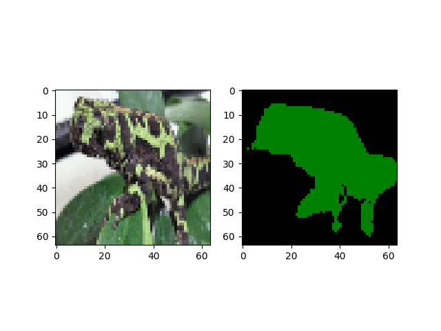
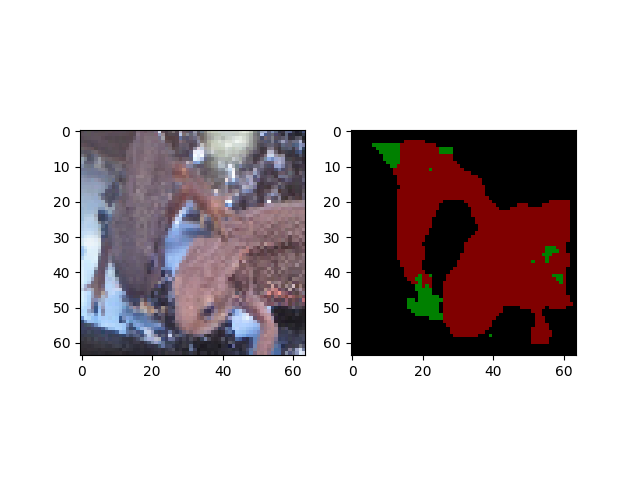

# Q. SemanticSegmentation編

ここではSemanticSegmentationの実装を行っていく。

## SemanticSegmentationとは?

これは画像に対してピクセル毎になんのクラスに属するかを予測するタスクである。

たとえばこんな感じです。赤が 「アカハライモリ」 、緑が「マダライモリ」、黒が「背景」

| 入力1(akahara_0005.jpg) | 出力1(akahara_0005.png) | 入力2(madara_0007.jpg) | 出力2(madara_0007.png) |
|:---:|:---:|:---:|:---:|
|  |  |   |   |

SemanticSegmentataionのイメージが掴めたでしょう。

これもディープラーニングでできるので、ここから実装する。

ここでも、**とりあえずPyTorch, Tensorflow, Keras, Chainer全部で実装してください。**
ネットワークを作ったら、学習率やイテレーションを変えて、テストデータセット *../Dataset/test/images* でテストせよ。

**ちなみにSemaSegのGround-truthは *../Dataset/train/seg_images* にある。
アカハライモリは RGB=(127,0,0)、マダライモリはRGB=(0,127,0)、背景はRGB=(0,0,0)で設定している。**

## Binalization Step.1. データセット読み込み

まずは簡単にSigmoidを使って、イモリか背景かを分類するSemanticSegmentationのモデルを作っていく。

ここではアカハライモリとマダライモリを区別せずに、イモリか否かの２クラスとなる。が、２クラスの場合はsigmoidを使うことで、ピクセル毎にイモリの確率を出せばいい。

つまり出力はイモリの部分の確率が高くなるようにすればいいよくて、こんなかんじ。

| 入力1(akahara_0005.jpg) | 出力1(akahara_0005_bin.png) | 入力2(madara_0007.jpg) | 出力2(madara_0007_bin.png) |
|:---:|:---:|:---:|:---:|
|  |  |   |   |


ということでこれを実現していく。

まずはデータセットの読み込みから。

入力画像の方は画像認識のときと同じで良いが、SemaSegではGround-truthの方も画像になっているので、工夫が必要である。
Groud-truthは *../Dataset/train/seg_images* にpngで入っている。(なぜpngかというとpngにしなければ画素の値がずれることがあるから。つまりground-truthとして機能させるにはpngとか値が絶対に変わらない拡張でなければならない)

pngを読みだら、イモリの位置になっている部分が1、それ以外が0となるようにground-truthを作成せよ。

答え
- Pytorch [answers/bin_dataset_pytorch.py](https://github.com/yoyoyo-yo/DeepLearningMugenKnock/blob/master/Question_semaseg/answers/bin_dataset_pytorch.py)
- Tensorflow [answers/bin_dataset_tensorflow_slim.py](https://github.com/yoyoyo-yo/DeepLearningMugenKnock/blob/master/Question_model/answers/bin_dataset_tensorflow_slim.py)
- Keras [answers/bin_dataset_keras.py](https://github.com/yoyoyo-yo/DeepLearningMugenKnock/blob/master/Question_model/answers/bin_dataset_keras.py)
- chainer [answers/lenet_chainer.py]()

## Binalization Step.2. 学習時のLoss計算

あとは学習するだけである。

ここでLossは*Sigmoid Cross Entropy* を用いる。各フレームワーク毎の使い方はこうだ。

### PyTorch
*torch.nn.BCELoss* を使う。ただし、これの引数はy, tとも*torch.float*型であるので注意。

```python
y = model(x)
y = y.permute(0,2,3,1).contiguous()
y = torch.sigmoid(y)
loss = torch.nn.BCELoss()(y, t)
```

まずはシンプルな構造として、入力画像に対して、
*Convolution(kernel_size=3, kernel_number=32, padding=1, stride=1) + BatchNormalization() +  ReLU*
を6回適用して最後に *Convolution(kernel_size=1, kernel_number=1, padding=0, stride=1)* を適用するネットワークを作成し、SigmoidによるBinalizationを実現せよ。入力画像サイズは64とする。（大きくしても良いがGPUを使わないと計算時間がキツキツになってしまうので注意）

答え
- Pytorch [answers/bin_loss_pytorch.py](https://github.com/yoyoyo-yo/DeepLearningMugenKnock/blob/master/Question_semaseg/answers/bin_loss_pytorch.py)
- Tensorflow [answers/bin_loss_tensorflow_slim.py](https://github.com/yoyoyo-yo/DeepLearningMugenKnock/blob/master/Question_model/answers/bin_loss_tensorflow_slim.py)
- Keras [answers/bin_loss_keras.py](https://github.com/yoyoyo-yo/DeepLearningMugenKnock/blob/master/Question_model/answers/bin_loss_keras.py)
- chainer [answers/lenet_chainer.py]()

## Binalization Step.3. テスト時の予測結果の表示

学習ができたら、テストあるのみ。ということで、テストデータセット *../Dataset/test/images* に対してのネットワークの出力を図示せよ。

図示はシンプルに出力した結果と閾値0.5で２値化したものを表示せよ。
２値化とは、あらかじめ決定した閾値以上の値を1、それ以外を0にする画像処理手法である。

だいたい500イテレーションくらい回したpytorchでの結果がこれである。画像処理ではマスク画像作成などでこのようなBinalizationが行われるので、最後に２値化することは多々ある。

| madara_0010.jpg (answers/bin_loss_answer1.png) | akahara_0010.jpg (answers/bin_loss_answer2.png) |
|:---:|:---:|
|  |  |


答え
- Pytorch [answers/bin_test_pytorch.py](https://github.com/yoyoyo-yo/DeepLearningMugenKnock/blob/master/Question_semaseg/answers/bin_test_pytorch.py)
- Tensorflow [answers/bin_test_tensorflow_silm.py](https://github.com/yoyoyo-yo/DeepLearningMugenKnock/blob/master/Question_model/answers/bin_test_tensorflow_slim.py)
- Keras [answers/bin_test_keras.py](https://github.com/yoyoyo-yo/DeepLearningMugenKnock/blob/master/Question_model/answers/bin_test_keras.py)
- chainer [answers/lenet_chainer.py]()

## Semantic Segmentation Step.1. データセット読み込み

ここからはBinalizationでなくクラス分類も含めたSemantic Segmentationを行っていく。

まずはデータセットの読み込みから。それぞれのフレームワークでやり方が少しことなるので注意。

### PyTorch

出力サイズと同じサイズのゼロ行列を容易し、各ピクセル毎にクラスのインデックスを割り当てていく。

```python
t = np.zeros((out_height, out_width), dtype=torch.int)
```

アカハライモリとマダライモリでこういう感じになり、紫がインデックス0で背景、緑がインデックス1でアカハライモリ、黄色がインデックス2でマダライモリとなる。

| assets/semaseg_gt_akahara_0008.png | assets/semaseg_gt_madara_0005.png |
|:---:|:---:|
|  |  |

答え
- Pytorch [answers/semaseg_dataset_pytorch.py](https://github.com/yoyoyo-yo/DeepLearningMugenKnock/blob/master/Question_semaseg/answers/semaseg_dataset_pytorch.py)
- Tensorflow [answers/semaseg_dataset_tensorflow_slim.py](https://github.com/yoyoyo-yo/DeepLearningMugenKnock/blob/master/Question_model/answers/semaseg_dataset_tensorflow_slim.py)
- Keras [answers/semaseg_dataset_keras.py](https://github.com/yoyoyo-yo/DeepLearningMugenKnock/blob/master/Question_model/answers/semaseg_dataset_keras.py)
- chainer [answers/lenet_chainer.py]()

## Semantic Segmentation Step.2. 学習時のLoss計算

データセットを容易すればあとは学習させるだけ！ということで学習に移るけど、SemaSegの場合はBinalizationと違って、Softmaxを使う必要がある。しかし、シンプルにSoftmaxを使ってはだめで、画像に対するSoftmaxのテクニックが必要となる。

方法としては、**モデルの出力は[ミニバッチ、高さ、幅、クラス数]のshapeを持っているが、これを[ミニバッチx高さx幅、クラス数]にreshapeして、softmaxとcross entropyを適用する**。これにより画像に対するsoftmaxの学習が実現できる。これは

pytorchやchainerは[ミニバッチ、チャネル、高さ、幅]のshapeだが、これをpytorchなら*permute()* を使って[ミニバッチ、高さ、幅、チャネル]の順に入れ替える必要があるので注意。

それぞれのアルゴリズム実装は次のようになる。ネットワーク構成はBinalization時と同じとする。

### Pytorch
1. 教師データを *permutate()* を用いて[ミニバッチ、高さ、幅、クラス数]の順にする。
2. 教師データを *view()* を用いて[ミニバッチx高さx幅、クラス数]にreshapeする。
3. ネットワークの出力を *view()* を用いて[ミニバッチx高さx幅]にreshapeする。
4. あとは物体認識と同じくsoftmax cross entropyを計算する。

だいたい500イテレーションくらい学習したpytorchでの結果がこれである。画像処理ではマスク画像作成などでこのようなBinalizationが行われるので、最後に２値化することは多々ある。


答え
- Pytorch [answers/semaseg_loss_pytorch.py](https://github.com/yoyoyo-yo/DeepLearningMugenKnock/blob/master/Question_semaseg/answers/semaseg_loss_pytorch.py)
- Tensorflow [answers/semaseg_loss_tensorflow_slim.py](https://github.com/yoyoyo-yo/DeepLearningMugenKnock/blob/master/Question_model/answers/semaseg_loss_tensorflow_slim.py)
- Keras [answers/semaseg_loss_keras.py](https://github.com/yoyoyo-yo/DeepLearningMugenKnock/blob/master/Question_model/answers/semaseg_loss_keras.py)
- chainer [answers/lenet_chainer.py]()

## Semantic Segmentation Step.3. テスト時の予測結果の表示

あとはテストデータで予測結果を見るだけ。出力はミニバッチ部分を取ると[高さ、幅、クラス数]となるので、numpyのargmaxをうまいこと使うと、ピクセル毎の確率が最大のクラスのインデックスを取ることができる。

それを用いて、アカハライモリのクラスはRGB=(127,0,0)、マダライモリはRGB=(0,127,0)、背景はRGB=(0,0,0)になるようなセグメンテーション画像を表示せよ。

これはPyTorchの出力例。

| madara_0010.jpg (answers/semaseg_loss_answer1.png) | akahara_0011.jpg (answers/semaseg_loss_answer2.png) |
|:---:|:---:|
|  |  |

答え
- Pytorch [answers/semaseg_test_pytorch.py](https://github.com/yoyoyo-yo/DeepLearningMugenKnock/blob/master/Question_semaseg/answers/semaseg_loss_pytorch.py)
- Tensorflow [answers/semaseg_test_tensorflow_slim.py](https://github.com/yoyoyo-yo/DeepLearningMugenKnock/blob/master/Question_model/answers/semaseg_test_tensorflow_slim.py)
- Keras [answers/semaseg_test_keras.py](https://github.com/yoyoyo-yo/DeepLearningMugenKnock/blob/master/Question_model/answers/semaseg_test_keras.py)
- chainer [answers/lenet_chainer.py]()
