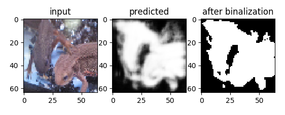
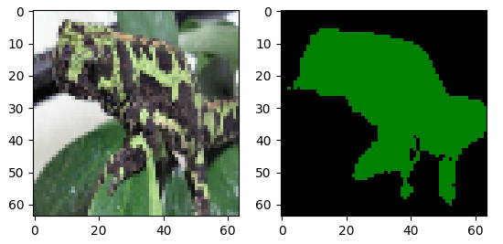

# Q. SemanticSegmentation編

ここではSemanticSegmentationの実装を行っていきます。

## SemanticSegmentationとは?

これは画像に対してピクセル毎になんのクラスに属するかを予測するタスクです。

たとえばこんな感じです。赤が 「アカハライモリ」 、緑が「マダライモリ」、黒が「背景」

| 入力1(akahara_0005.jpg) | 出力1(akahara_0005.png) | 入力2(madara_0007.jpg) | 出力2(madara_0007.png) |
|:---:|:---:|:---:|:---:|
|  |  |   |   |

SemanticSegmentataionのイメージが掴めたでしょう。

これもディープラーニングでできるので、ここから実装していきます。

ここでも、**とりあえずPyTorch, Tensorflow, Keras, Chainer全部で実装してください。**
ネットワークを作ったら、学習率やイテレーションを変えて、テストデータセット *../Dataset/test/images* でテストしてください。

**ちなみにSemaSegのGround-truthは *../Dataset/train/seg_images* にあります。
アカハライモリは RGB=(127,0,0)、マダライモリはRGB=(0,127,0)、背景はRGB=(0,0,0)で設定してます。**

## Binalization Step.1. データセット読み込み

まずは簡単にSigmoidを使って、イモリか背景かを分類するSemanticSegmentationのモデルを作っていきます。

ここではアカハライモリとマダライモリを区別せずに、イモリか否かの２クラスとなります。が、２クラスの場合はsigmoidを使うことで、ピクセル毎にイモリの確率を出せばいいです。

つまり出力はイモリの部分の確率が高くなるようにすればいいよくて、こんなかんじ。

| 入力1(akahara_0005.jpg) | 出力1(akahara_0005_bin.png) | 入力2(madara_0007.jpg) | 出力2(madara_0007_bin.png) |
|:---:|:---:|:---:|:---:|
|  |  |   |   |


ということでこれを実現していきます！！

まずはデータセットの読み込みから。

入力画像の方は画像認識のときと同じで良いが、SemaSegではGround-truthの方も画像になっているので、工夫が必要です。
Groud-truthは *../Dataset/train/seg_images* にpngで入ってます。(なぜpngかというとpngにしなければ画素の値がずれることがあるから。つまりground-truthとして機能させるにはpngとか値が絶対に変わらない拡張でなければならない)

pngを読み込んだら、イモリの位置になっている部分が1、それ以外が0となるようにground-truthを作成してください。

答え
- Pytorch [answers/bin_dataset_pytorch.py](https://github.com/yoyoyo-yo/DeepLearningMugenKnock/blob/master/Question_semaseg/answers/bin_dataset_pytorch.py)
- Tensorflow [answers/bin_dataset_tensorflow_slim.py](https://github.com/yoyoyo-yo/DeepLearningMugenKnock/blob/master/Question_model/answers/bin_dataset_tensorflow_slim.py)
- Keras [answers/bin_dataset_keras.py](https://github.com/yoyoyo-yo/DeepLearningMugenKnock/blob/master/Question_model/answers/bin_dataset_keras.py)
- chainer [answers/bin_dataset_chainer.py](https://github.com/yoyoyo-yo/DeepLearningMugenKnock/blob/master/Question_model/answers/bin_dataset_chainer.py)

## Binalization Step.2. 学習時のLoss計算

あとは学習するだけでっす。

ここでLossは*Sigmoid Cross Entropy* を用います。各フレームワーク毎の使い方はこうです。

### PyTorch
*torch.nn.BCELoss* を使います。ただし、これの引数はy, tとも*torch.float*型であるので注意。

```python
y = model(x)
y = y.permute(0,2,3,1).contiguous()
y = torch.sigmoid(y)
loss = torch.nn.BCELoss()(y, t)
```

まずはシンプルな構造として、入力画像に対して、
*Convolution(kernel_size=3, kernel_number=32, padding=1, stride=1) + ReLU + BatchNormalization()*
を6回適用して最後に *Convolution(kernel_size=1, kernel_number=1, padding=0, stride=1)* を適用するネットワークを作成し、SigmoidによるBinalizationを実現してください。入力画像サイズは64とします。（大きくしても良いがGPUを使わないと計算時間がキツキツになってしまうので注意！）(BatchNormalizationの後にReLUする場合もあるが、ReLUの後にBNの法が今回はきれいにいったのでこれでいきます)

答え
- Pytorch [answers/bin_loss_pytorch.py](https://github.com/yoyoyo-yo/DeepLearningMugenKnock/blob/master/Question_semaseg/answers/bin_loss_pytorch.py)
- Tensorflow [answers/bin_loss_tensorflow_slim.py](https://github.com/yoyoyo-yo/DeepLearningMugenKnock/blob/master/Question_model/answers/bin_loss_tensorflow_slim.py)
- Keras [answers/bin_loss_keras.py](https://github.com/yoyoyo-yo/DeepLearningMugenKnock/blob/master/Question_model/answers/bin_loss_keras.py)
- chainer [answers/bin_loss_chainer.py](https://github.com/yoyoyo-yo/DeepLearningMugenKnock/blob/master/Question_model/answers/bin_loss_chainer.py)

## Binalization Step.3. テスト時の予測結果の表示

学習ができたら、テストあるのみ。ということで、テストデータセット *../Dataset/test/images* に対してのネットワークの出力を図示してください。

図示はシンプルに出力した結果と閾値0.5で２値化したものを表示してください。
２値化とは、あらかじめ決定した閾値以上の値を1、それ以外を0にする画像処理手法です。

だいたい500イテレーションくらい回したpytorchでの結果がこれです。画像処理ではマスク画像作成などでこのようなBinalizationが行われるので、最後に２値化することはよくあります。

| madara_0010.jpg (answers/answer_bin_loss_pytorch_madara_0010.png) | akahara_0011.jpg (answers/answer_bin_loss_pytorch_akahara_0011.png) |
|:---:|:---:|
|  |  |


答え
- Pytorch [answers/bin_test_pytorch.py](https://github.com/yoyoyo-yo/DeepLearningMugenKnock/blob/master/Question_semaseg/answers/bin_test_pytorch.py)
- Tensorflow [answers/bin_test_tensorflow_silm.py](https://github.com/yoyoyo-yo/DeepLearningMugenKnock/blob/master/Question_model/answers/bin_test_tensorflow_slim.py)
- Keras [answers/bin_test_keras.py](https://github.com/yoyoyo-yo/DeepLearningMugenKnock/blob/master/Question_model/answers/bin_test_keras.py)
- chainer [answers/bin_test_chainer.py](https://github.com/yoyoyo-yo/DeepLearningMugenKnock/blob/master/Question_model/answers/bin_test_chainer.py)

## Semantic Segmentation Step.1. データセット読み込み

ここからはBinalizationでなくクラス分類も含めたSemantic Segmentationを行っていきます。

まずはデータセットの読み込みから。それぞれのフレームワークでやり方が少しことなるので注意。

### PyTorch

出力サイズと同じサイズのゼロ行列を容易し、各ピクセル毎にクラスのインデックスを割り当てていきます。

```python
t = np.zeros((out_height, out_width), dtype=torch.int)
```

アカハライモリとマダライモリでこういう感じで、紫がインデックス0で背景、緑がインデックス1でアカハライモリ、黄色がインデックス2でマダライモリとなります。

| assets/semaseg_gt_akahara_0008.png | assets/semaseg_gt_madara_0005.png |
|:---:|:---:|
|  |  |

答え
- Pytorch [answers/semaseg_dataset_pytorch.py](https://github.com/yoyoyo-yo/DeepLearningMugenKnock/blob/master/Question_semaseg/answers/semaseg_dataset_pytorch.py)
- Tensorflow [answers/semaseg_dataset_tensorflow_slim.py](https://github.com/yoyoyo-yo/DeepLearningMugenKnock/blob/master/Question_model/answers/semaseg_dataset_tensorflow_slim.py)
- Keras [answers/semaseg_dataset_keras.py](https://github.com/yoyoyo-yo/DeepLearningMugenKnock/blob/master/Question_model/answers/semaseg_dataset_keras.py)
- chainer [answers/lenet_chainer.py](https://github.com/yoyoyo-yo/DeepLearningMugenKnock/blob/master/Question_model/answers/semaseg_dataset_chainer.py)

## Semantic Segmentation Step.2. 学習時のLoss計算

データセットを容易すればあとは学習させるだけ！ということで学習に移るけど、SemaSegの場合はBinalizationと違って、Softmaxを使う必要です。しかし、シンプルにSoftmaxを使ってはだめで、画像に対するSoftmaxのテクニックが必要です。

方法としては、**モデルの出力は[ミニバッチ、高さ、幅、クラス数]のshapeを持っているが、これを[ミニバッチx高さx幅、クラス数]にreshapeして、softmaxとcross entropyを適用します**。これにより画像に対するsoftmaxの学習が実現できます。これは

pytorchやchainerは[ミニバッチ、チャネル、高さ、幅]のshapeだが、これをpytorchなら*permute()* を使って[ミニバッチ、高さ、幅、チャネル]の順に入れ替える必要があるので注意です。

それぞれのアルゴリズム実装は次のようになります。ネットワーク構成はBinalization時と同じとします。

### Pytorch
1. 教師データを *permutate()* を用いて[ミニバッチ、高さ、幅、クラス数]の順にする。
2. 教師データを *view()* を用いて[ミニバッチx高さx幅、クラス数]にreshapeする。
3. ネットワークの出力を *view()* を用いて[ミニバッチx高さx幅]にreshapeする。
4. あとは物体認識と同じくsoftmax cross entropyを計算する。

だいたい500イテレーションくらい学習したpytorchでの結果がこれです。画像処理ではマスク画像作成などでこのようなBinalizationが行われるので、最後に２値化することはよくあります。


答え
- Pytorch [answers/semaseg_loss_pytorch.py](https://github.com/yoyoyo-yo/DeepLearningMugenKnock/blob/master/Question_semaseg/answers/semaseg_loss_pytorch.py)
- Tensorflow [answers/semaseg_loss_tensorflow_slim.py](https://github.com/yoyoyo-yo/DeepLearningMugenKnock/blob/master/Question_model/answers/semaseg_loss_tensorflow_slim.py)
- Keras [answers/semaseg_loss_keras.py](https://github.com/yoyoyo-yo/DeepLearningMugenKnock/blob/master/Question_model/answers/semaseg_loss_keras.py)
- chainer [answers/lenet_chainer.py](https://github.com/yoyoyo-yo/DeepLearningMugenKnock/blob/master/Question_model/answers/semaseg_loss_chainer.py)

## Semantic Segmentation Step.3. テスト時の予測結果の表示

あとはテストデータで予測結果を見るだけ。出力はミニバッチ部分を取ると[高さ、幅、クラス数]となるので、numpyのargmaxをうまいこと使うと、ピクセル毎の確率が最大のクラスのインデックスを取ることができます。

それを用いて、アカハライモリのクラスはRGB=(127,0,0)、マダライモリはRGB=(0,127,0)、背景はRGB=(0,0,0)になるようなセグメンテーション画像を表示してください。

これはPyTorchの出力例。

| madara_0010.jpg (answers/answer_semaseg_loss_pytorch_madara_0010.png) | akahara_0011.jpg (answers/answer_semaseg_loss_pytorch_akahara_0011.png) |
|:---:|:---:|
|  |  |

答え
- Pytorch [answers/semaseg_test_pytorch.py](https://github.com/yoyoyo-yo/DeepLearningMugenKnock/blob/master/Question_semaseg/answers/semaseg_loss_pytorch.py)
- Tensorflow [answers/semaseg_test_tensorflow_slim.py](https://github.com/yoyoyo-yo/DeepLearningMugenKnock/blob/master/Question_model/answers/semaseg_test_tensorflow_slim.py)
- Keras [answers/semaseg_test_keras.py](https://github.com/yoyoyo-yo/DeepLearningMugenKnock/blob/master/Question_model/answers/semaseg_test_keras.py)
- chainer [answers/lenet_chainer.py](https://github.com/yoyoyo-yo/DeepLearningMugenKnock/blob/master/Question_model/answers/semaseg_test_chainer.py)

## UpSampling手法1. NearestNeighbor補間

ここまでで、学習の方法はができたので、あとは論文に沿って忠実にネットワークを再現していきます。

CNNはよくMaxPoolingやstride2のconvolutionなどで画像サイズを小さくしていくので(Down sampling、ダウンサンプリングという)、入力画像のサイズと比べると段々小さくなってしまいます。しかしセグメンテーションではサイズが小さいと解像度が小さくなってしまい、きれいな出力が得られません。なので、画像サイズを上げるためにUpSampling（アップサンプリング）する必要があります。

よくあるのは、NearestNeighbor補間(最近傍補間)でサイズを２倍にする方法です。この補間は画像処理でよく使われる手法です。一度MaxpoolingしてNearestNeighborでupsampleしていきます。

ネットワーク構成は、
1. Convoluton(kernel_size=3, kerner_num=32, padding=1, stride=1) + ReLU + BN を２回
2. MaxPooling(kernel_size=2, stride=2)
3. Convoluton(kernel_size=3, kerner_num=32, padding=1, stride=1) + ReLU + BN を２回
4. Bilinear補間でサイズを２倍にする。
5. Convoluton(kernel_size=3, kerner_num=32, padding=1, stride=1) + ReLU + BN を２回
6. Convoluton(kernel_size=1, kerner_num=3, padding=0, stride=1) + Softmax
としてsegmentationを実現してください。

Nearest Neighborの方法

| FW | function | FW | function |
|:---:|:---:|:---:|:---:|
| pytorch | torch.nn.functional.interpolate | Keras | keras.layers.UpSampling2D |
| TensorFlow | tf.image.resize_images | Chainer | chainer.functions.resize_image (NearestNeighborがなかったのでBilinearで対応) |

これはPyTorchの出力例。

| madara_0010.jpg (answers/answer_nearest_pytorch_madara_0010.png) | akahara_0011.jpg (answers/answer_nearest_pytorch_akahara_0011.png) |
|:---:|:---:|
|  |  |

答え
- Pytorch [answers/nearest_pytorch.py](https://github.com/yoyoyo-yo/DeepLearningMugenKnock/blob/master/Question_semaseg/answers/nearest_pytorch.py)
- Tensorflow [answers/nearest_tensorflow_slim.py](https://github.com/yoyoyo-yo/DeepLearningMugenKnock/blob/master/Question_model/answers/nearest_tensorflow_slim.py)
- Keras [answers/nearest_keras.py](https://github.com/yoyoyo-yo/DeepLearningMugenKnock/blob/master/Question_model/answers/nearest_keras.py)
- chainer [answers/nearest_chainer.py](https://github.com/yoyoyo-yo/DeepLearningMugenKnock/blob/master/Question_model/answers/nearest_chainer.py)

## UpSampling手法2. Transposed Convolution

２つ目の方法はTransposed convolutionを使う方法です。これはconvolutionの逆なんですが、たまに*deconvolution* と言われたりするんですが、その呼び方は正しくないらしく、*transposed convolution* の方がいいらしいです。（たしかDCGANの論文に書いてました。）

通常のconvolutionはstride=2にすると、画像サイズが半分になるのですが、**transposed convはstride=2にすると、画像サイズが２倍になります。**　これはtranspose convでは入力画像の１列毎、一行ごとに0のパディングを加えていくからです。パディング後にconvolutionのようにカーネル処理をstride=1にして行うので、画像サイズが2倍になります。つまり、transposed convのstrideとは0パディングの大きさを意味するのです。

個人的体感だけど、Transposed Convolutionの方が学習の収束が悪い気がします。多分パラメータが増えていることで学習が難しくなっているので、NearestNeighborを使った方がいいと思いますマル

ネットワークのnearest neighborの部分 Transposed conv(kernel_size=2, kernel_num=32, stride=2) + ReLU + BN に変更してネットワークを作成してください。

Transposed convolutionの方法

| FW | function | FW | function |
|:---:|:---:|:---:|:---:|
| pytorch | torch.nn.ConvTranspose2d | Keras | keras.layers.Conv2DTranspose |
| TensorFlow | slim.conv2d_transpose | Chainer | chainer.links.Deconvolution2D (なぜかchainerはdeconvolutionの名前) |

| madara_0010.jpg (answers/answer_transposeconv_pytorch_madara_0010.png) | akahara_0011.jpg (answers/answer_transposeconv_pytorch_akahara_0011.png) |
|:---:|:---:|
|  |  |

答え
- Pytorch [answers/transposeconv_pytorch.py](https://github.com/yoyoyo-yo/DeepLearningMugenKnock/blob/master/Question_semaseg/answers/transposeconv_pytorch.py)
- Tensorflow [answers/transposeconv_tensorflow_slim.py](https://github.com/yoyoyo-yo/DeepLearningMugenKnock/blob/master/Question_model/answers/transposeconv_tensorflow_slim.py)
- Keras [answers/transposeconv_keras.py](https://github.com/yoyoyo-yo/DeepLearningMugenKnock/blob/master/Question_model/answers/transposeconv_keras.py)
- chainer [answers/transposeconv_chainer.py](https://github.com/yoyoyo-yo/DeepLearningMugenKnock/blob/master/Question_model/answers/transposeconv_chainer.py)

ここまででセグメンテーションを行うための基本は終わり。次から論文の実装に入っていきます！！

## 特徴マップのconcat

ここではセグメンテーションのもう一つのテクニックを紹介します。それが特徴マップの結合(concat)です。よくあるのが、一度downsampleしてupsapmleしたものとdownsampleする前の特徴マップをチャンネル方向に結合する方法です。これによって様々な特徴量を利用できるとされていて、また、プーリングによって荒くなった特徴量の活性化を精細にできるとも考えられている。


このように少し前の層の特徴マップをチャネル方向に結合する手法は **skip connection** と呼ばれ、ResNetで提案されたものである。これによって出力層から伝搬してきたlossの勾配を減少せずに伝搬できると考えられている。

ここではTransposed convolutionで作成したネットワークでの特徴マップのconcatを追加せよ。特徴マップを合成したものに対しては、convolution(kernel_size=1, kernel_num=結合前のチャネル, padding=0, stride=1)を適用することが多い。これにより、特徴マップの結合によりチャネル数が多くなり計算量が増えることを防ぎ、特徴量を合成することができる。

1. Convoluton(kernel_size=3, kerner_num=32, padding=1, stride=1) + ReLU + BN を２回
2. MaxPooling(kernel_size=2, stride=2)
3. Convoluton(kernel_size=3, kerner_num=32, padding=1, stride=1) + ReLU + BN を２回
4. Transposed convolution(kernel_size=2, kernel_num=32, padding=0, stride=2) + ReLU + BN
5. 4と1をチャネル方向に結合
6. Convolution(kernel_size=1, kernel_size=32, padding=0, stride=1) + ReLU + BN
6. Convoluton(kernel_size=3, kerner_num=32, padding=1, stride=1) + ReLU + BN を２回
7. Convoluton(kernel_size=1, kerner_num=3, padding=0, stride=1) + Softmax

結合の方法

| FW | function | FW | function |
|:---:|:---:|:---:|:---:|
| pytorch | torch.cat | Keras | keras.layers.concatenate |
| TensorFlow | tf.concat | Chainer | chainer.links.Deconvolution2D (なぜかchainerはdeconvolutionの名前) |

## UNet

論文 >> https://arxiv.org/abs/1505.04597

まずはUNet。これはもともと医療の画像処理の中で、細胞をセグメンテーションするために提案されたネットワークです。Uの由来は論文中のFig.1のモデルの形がUに見えるから。（Vやんとか言っちゃだめ）
